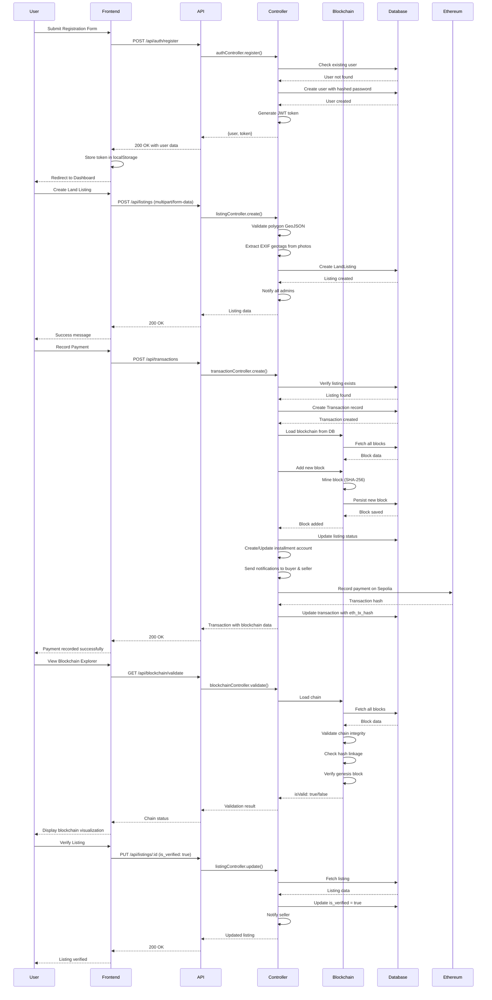
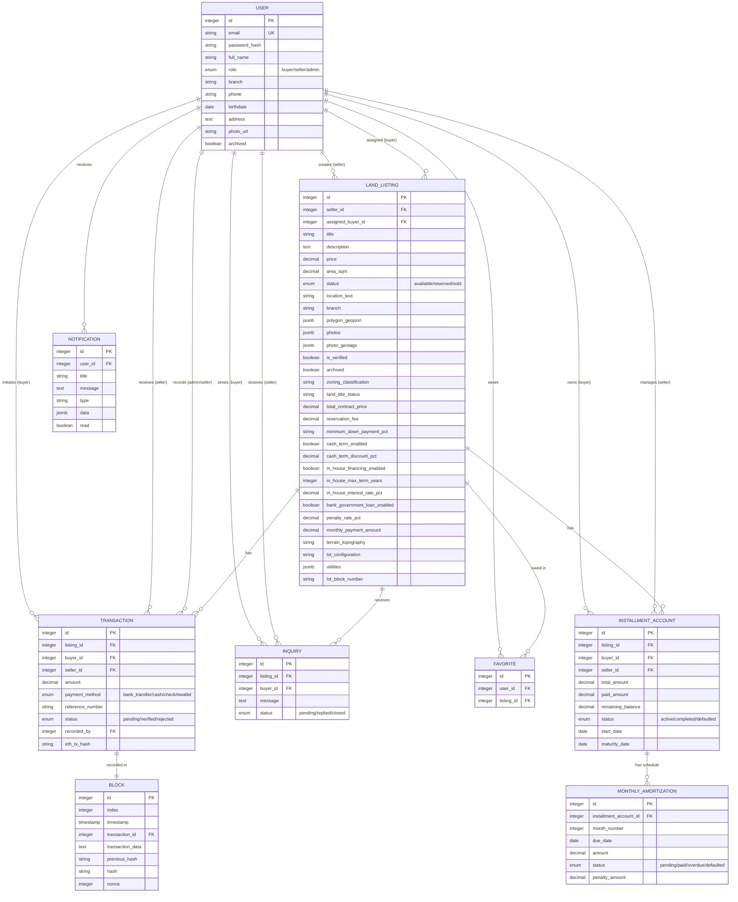

# Terrava Architecture Diagrams

## Logical View Diagram

The Logical View shows the static structure of the Terrava system, including components, modules, and their relationships.

```mermaid
graph TB
    subgraph "Frontend Layer (React)"
        A[App.jsx]
        B[Pages]
        C[Components]
        D[Context Providers]
        E[AuthContext]
        F[NotificationContext]
        G[ToastContext]
        
        B --> B1[Home]
        B --> B2[Landing]
        B --> B3[Login/Register]
        B --> B4[Dashboard]
        B --> B5[AdminDashboard]
        B --> B6[CreateListing]
        B --> B7[ListingDetail]
        B --> B8[Transactions]
        B --> B9[BlockchainExplorer]
        B --> B10[MapExplore]
        
        C --> C1[Navbar]
        C --> C2[Sidebar]
        C --> C3[AdminSidebar]
        C --> C4[MapView]
        C --> C5[CreateListingForm]
        C --> C6[RecordPaymentModal]
        
        D --> E
        D --> F
        D --> G
    end
    
    subgraph "API Layer (Express Routes)"
        H[Auth Routes]
        I[Listing Routes]
        J[Transaction Routes]
        K[Blockchain Routes]
        L[Admin Routes]
        M[Inquiry Routes]
        N[Notification Routes]
        O[Installment Routes]
    end
    
    subgraph "Controller Layer"
        P[Auth Controller]
        Q[Listing Controller]
        R[Transaction Controller]
        S[Blockchain Controller]
        T[Admin Controller]
        U[Inquiry Controller]
        V[Notification Controller]
        W[Installment Controller]
    end
    
    subgraph "Business Logic Layer"
        X[Blockchain Service]
        Y[Installment Service]
        Z[Password Utility]
        AA[JWT Utility]
        AB[Email Utility]
        AC[EXIF Utility]
        AD[Ethereum Utility]
    end
    
    subgraph "Data Layer (Sequelize Models)"
        AE[User Model]
        AF[LandListing Model]
        AG[Transaction Model]
        AH[Block Model]
        AI[Inquiry Model]
        AJ[Favorite Model]
        AK[Notification Model]
        AL[InstallmentAccount Model]
        AM[MonthlyAmortization Model]
    end
    
    subgraph "Database Layer"
        AN[(PostgreSQL)]
        AO[(SQLite - Backup)]
    end
    
    subgraph "External Services"
        AP[Google OAuth]
        AQ[Ethereum Sepolia]
        AR[Nodemailer SMTP]
    end
    
    subgraph "Background Jobs"
        AS[Overdue Payment Cron]
    end
    
    %% Frontend to API
    B --> H
    B --> I
    B --> J
    B --> K
    B --> L
    B --> M
    B --> N
    B --> O
    
    %% API to Controllers
    H --> P
    I --> Q
    J --> R
    K --> S
    L --> T
    M --> U
    N --> V
    O --> W
    
    %% Controllers to Business Logic
    P --> Z
    P --> AA
    Q --> AC
    R --> X
    R --> Y
    R --> AD
    T --> AB
    
    %% Controllers to Models
    P --> AE
    Q --> AF
    R --> AG
    S --> AH
    U --> AI
    V --> AK
    W --> AL
    W --> AM
    
    %% Models to Database
    AE --> AN
    AF --> AN
    AG --> AN
    AH --> AN
    AI --> AN
    AJ --> AN
    AK --> AN
    AL --> AN
    AM --> AN
    
    %% External Integrations
    P --> AP
    R --> AQ
    T --> AR
    
    %% Background Jobs
    AS --> W
    AS --> AN
    
    %% Context usage
    B --> E
    B --> F
    B --> G
```

## Runtime View Diagram

The Runtime View shows the dynamic behavior and interaction patterns of the system during key operations.

## Use Case View Diagram

The Use Case View shows the functional requirements from the perspective of different user roles.

```mermaid
graph TB
    subgraph "Actors"
        Admin((Admin))
        Seller((Seller))
        Buyer((Buyer))
        Guest((Guest))
    end
    
    subgraph "Authentication Use Cases"
        UC1[Register Account]
        UC2[Login]
        UC3[Google OAuth Login]
        UC4[Logout]
        UC5[Change Password]
        UC6[Update Profile]
        UC7[Upload Profile Photo]
    end
    
    subgraph "Land Listing Use Cases"
        UC8[Browse Land Listings]
        UC9[View Listing Details]
        UC10[Search & Filter Listings]
        UC11[View on Interactive Map]
        UC12[Compare Listings]
        UC13[Add to Favorites]
        UC14[Create Land Listing]
        UC15[Edit Land Listing]
        UC16[Delete Land Listing]
        UC17[Assign Buyer to Listing]
        UC18[Unassign Buyer]
    end
    
    subgraph "Transaction Use Cases"
        UC19[Send Inquiry to Seller]
        UC20[Reply to Inquiry]
        UC21[Record Payment]
        UC22[View Transaction History]
        UC23[View My Lands]
        UC24[View Sales Report]
    end
    
    subgraph "Installment Use Cases"
        UC25[View Installment Account]
        UC26[View Payment Schedule]
        UC27[Track Payment Progress]
    end
    
    subgraph "Blockchain Use Cases"
        UC28[View Blockchain Explorer]
        UC29[Validate Chain Integrity]
        UC30[View Block Details]
        UC31[Unlock Blockchain Ledger]
    end
    
    subgraph "Admin Use Cases"
        UC32[View Admin Dashboard]
        UC33[Verify Listings]
        UC34[Manage Users]
        UC35[Monitor Branches]
        UC36[View Verifications Queue]
        UC37[View Global Analytics]
        UC38[Manage System Logs]
    end
    
    subgraph "Notification Use Cases"
        UC39[View Notifications]
        UC40[Mark Notification as Read]
    end
    
    %% Guest access
    Guest --> UC1
    Guest --> UC2
    Guest --> UC3
    Guest --> UC8
    Guest --> UC9
    Guest --> UC10
    Guest --> UC11
    
    %% Buyer access
    Buyer --> UC1
    Buyer --> UC2
    Buyer --> UC3
    Buyer --> UC4
    Buyer --> UC5
    Buyer --> UC6
    Buyer --> UC7
    Buyer --> UC8
    Buyer --> UC9
    Buyer --> UC10
    Buyer --> UC11
    Buyer --> UC12
    Buyer --> UC13
    Buyer --> UC19
    Buyer --> UC20
    Buyer --> UC22
    Buyer --> UC23
    Buyer --> UC25
    Buyer --> UC26
    Buyer --> UC27
    Buyer --> UC39
    Buyer --> UC40
    
    %% Seller access
    Seller --> UC1
    Seller --> UC2
    Seller --> UC3
    Seller --> UC4
    Seller --> UC5
    Seller --> UC6
    Seller --> UC7
    Seller --> UC8
    Seller --> UC9
    Seller --> UC10
    Seller --> UC11
    Seller --> UC12
    Seller --> UC14
    Seller --> UC15
    Seller --> UC16
    Seller --> UC17
    Seller --> UC18
    Seller --> UC19
    Seller --> UC20
    Seller --> UC21
    Seller --> UC22
    Seller --> UC24
    Seller --> UC25
    Seller --> UC26
    Seller --> UC27
    Seller --> UC39
    Seller --> UC40
    
    %% Admin access
    Admin --> UC1
    Admin --> UC2
    Admin --> UC3
    Admin --> UC4
    Admin --> UC5
    Admin --> UC6
    Admin --> UC7
    Admin --> UC8
    Admin --> UC9
    Admin --> UC10
    Admin --> UC11
    Admin --> UC12
    Admin --> UC13
    Admin --> UC14
    Admin --> UC15
    Admin --> UC16
    Admin --> UC17
    Admin --> UC18
    Admin --> UC19
    Admin --> UC20
    Admin --> UC21
    Admin --> UC22
    Admin --> UC23
    Admin --> UC24
    Admin --> UC25
    Admin --> UC26
    Admin --> UC27
    Admin --> UC28
    Admin --> UC29
    Admin --> UC30
    Admin --> UC31
    Admin --> UC32
    Admin --> UC33
    Admin --> UC34
    Admin --> UC35
    Admin --> UC36
    Admin --> UC37
    Admin --> UC38
    Admin --> UC39
    Admin --> UC40
```

## Component Relationships

## Technology Stack Summary

### Frontend
- **Framework**: React 18 with Vite
- **Styling**: TailwindCSS
- **Maps**: Leaflet (GIS integration)
- **Icons**: Lucide React
- **Routing**: React Router v6
- **State Management**: React Context API
- **Authentication**: JWT tokens stored in localStorage

### Backend
- **Runtime**: Node.js
- **Framework**: Express.js
- **ORM**: Sequelize
- **Databases**: PostgreSQL (primary), SQLite (backup)
- **Authentication**: bcryptjs for password hashing, JWT for tokens
- **File Upload**: Multer with EXIF extraction
- **Email**: Nodemailer
- **Scheduling**: node-cron for overdue payment checks

### Blockchain
- **Private Chain**: Custom SHA-256 linked blockchain stored in PostgreSQL
- **Public Chain**: Ethereum Sepolia testnet integration
- **Smart Contracts**: Hardhat for deployment
- **Consensus**: Proof-of-Work (mining difficulty: 2)

### Key Features
- Multi-branch land management (6 branches)
- Role-based access control (buyer, seller, admin)
- GIS-based land mapping with polygon boundaries
- Photo geotagging for verification
- Installment payment tracking with amortization schedules
- Real-time notifications
- Blockchain payment verification
- Admin dashboard with analytics
